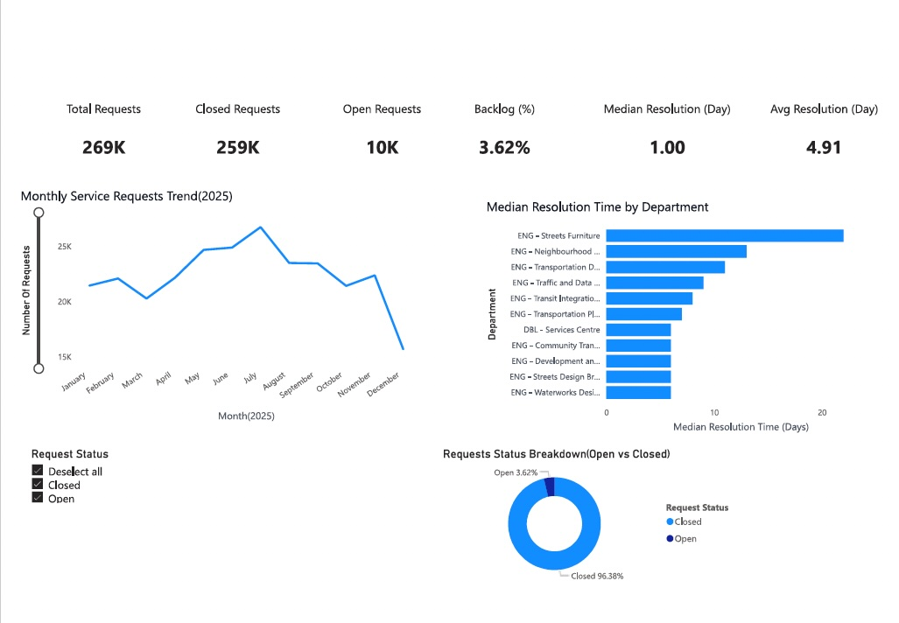

# 3-1-1 Service Requests Dashboard (2025)



## Project Overview
This project analyzes municipal **3-1-1 service requests** using an end-to-end data analytics workflow.
The goal is to evaluate operational performance, identify service bottlenecks, and present **actionable insights** through an interactive **Power BI dashboard**.

The analysis focuses on **2025 data** to provide timely, operationally relevant insights.

---

## Key Questions Answered
- How many service requests were submitted and resolved?
- What percentage of requests remain open (**backlog**)?
- How long does it typically take to resolve a request?
- Which departments experience longer resolution times?
- How does service demand vary by month?

---

## Key KPIs
- **Total Requests**
- **Closed Requests**
- **Open Requests**
- **Backlog Percentage (~3.6%)**
- **Median Resolution Time (Days)**
- **Average Resolution Time (Days)**

---

## Dashboard Features
- KPI cards highlighting overall workload and backlog
- Monthly trend analysis of service requests
- Department-level comparison of resolution times
- Request status breakdown (Open vs Closed)
- Interactive slicers for:
  - Department
  - Request Status
  - Service Request Type
  - Month

---

## Data Preparation
Data preparation and KPI engineering were performed in **Python (Pandas)**.

Key steps included:
- Parsing and standardizing datetime fields
- Handling missing close dates
- Calculating resolution time in days
- Correcting invalid negative resolution values
- Creating Power BI–ready analytical fields

📓 **Notebook:** `notebooks/01_data_cleaning_and_kpis.ipynb`

---

## Technology Stack
- **Python** (Pandas, Jupyter Notebook)
- **Power BI**
- **DAX**
- **GitHub**

---

## Project Structure
```text
311-service-requests-dashboard/
├── data/
│   └── 3-1-1-service-requests.csv
│
├── notebooks/
│   └── 01_data_cleaning_and_kpis.ipynb
│
├── powerbi/
│   └── 311_dashboard.pbix
│
├── screenshots/
│   └── dashboard_preview.png
│
├── README.md
```

---

## Outcome
This dashboard provides a clear operational view of municipal service performance by:
- Highlighting backlog levels and resolution efficiency
- Identifying departments with longer resolution times
- Enabling stakeholders to monitor workload trends over time

## Author
Haleh Bozorgnia  
Junior Data Analyst  
Tools: Python | SQL | Power BI | Data Visualization
